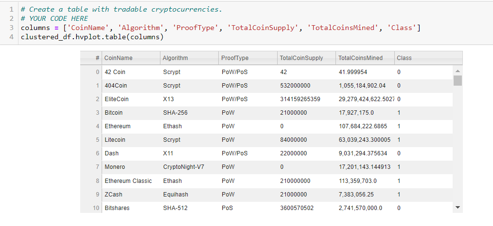
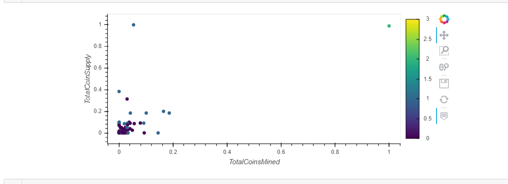

## Cryptocurrencies

This analysis is done for an investment bank "Accountability Accounting".  This bank is looking into offering their clients a new cryptocurrencies portfolio. They need to know what cryptocurrencies are trading on the market and how to classify them to show them to their clients.  To get this done the following steps were performed:
*  the cryptocurrencies data was prepared for PCA
*  PCA was used for reducing data dimensions
*  K-means was used to cluster the cryptocurrencies
*  the results are visualized with hvplot scatter plot

Table showing all the columns:

Hvplot showing Total Coins Mined and Total Coin Supply:

